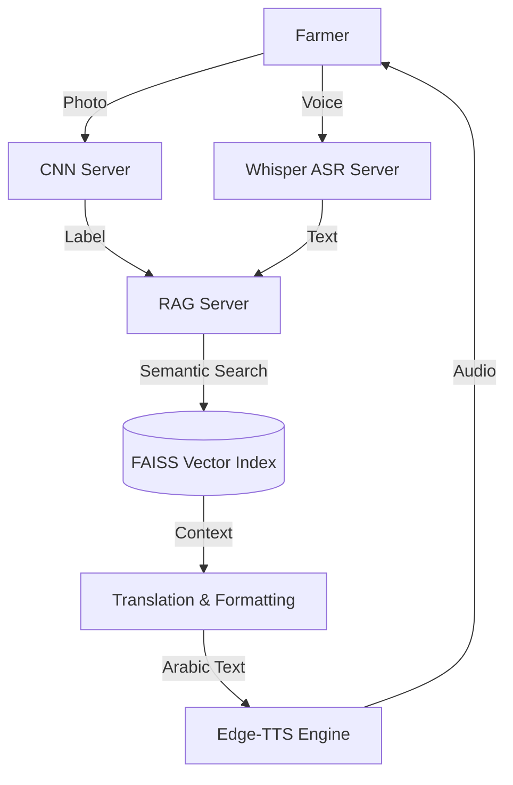

# 🫒 Olive Health Assistant — Voice-Enabled RAG & Vision

A specialized AI assistant designed for Tunisian olive farmers. This project combines **Computer Vision** (CNN), **Retrieval-Augmented Generation** (RAG), and **Speech-to-Text** (ASR) to diagnose olive leaf diseases and provide grounded agricultural advice in the Tunisian dialect.

---

## 🌟 Key Features

- **📸 Leaf Disease Diagnosis**: Upload a photo of an olive leaf, and our custom CNN model identifies the disease (e.g., Peacock Spot, Verticillium Wilt) with high confidence.
- **🎙️ Tunisian Voice Interface**: Ask questions naturally in **Tunisian Darija**. Our optimized Whisper pipeline transcribes local dialect speech with high accuracy.
- **📚 Grounded RAG Brain**: Answers are strictly grounded in technical manuals from **FAO**, **EPPO**, and **IOC**. No AI hallucinations—just verified agricultural science.
- **🗣️ Natural Voice Responses**: The assistant replies in a Tunisian-accented voice, making technical advice accessible to all farmers.
- **🆓 100% Free & Open**: No API keys required! The entire stack runs locally or via free open-source APIs.

---

## 🏗️ Architecture



---

## 🚀 Getting Started

### 1. Prerequisites
- Python 3.10+
- **FFmpeg** installed and added to your system PATH (required for audio processing).
- A GPU is highly recommended for the ASR and CNN servers (but CPU fallback is supported).

### 2. Installation
Clone the repository and install dependencies:
```bash
pip install -r requirements.txt
```

### 3. Initialize the Knowledge Base
Run the corpus builder to download technical PDFs, chunk the text, and generate the FAISS vector index:
```bash
python build_corpus.py
```

### 4. Start the Backend Servers
You need to run the three microservices simultaneously:

- **ASR Server** (Speech-to-Text):
  ```bash
  python asr_server.py
  ```
- **CNN Server** (Disease Detection):
  ```bash
  python cnn_server.py
  ```
- **RAG Server** (Knowledge & TTS):
  ```bash
  python rag_server.py
  ```

> [!TIP]
> **Run all at once:**
> You can use the provided scripts to start all three servers with a single command:
> - **Git Bash / Linux:** `./dev.sh`
> - **Windows CMD:** `dev.bat`


### 5. Launch the UI
Simply open `index_full.html` in your web browser to start using the assistant.

---

## 🛠️ Tech Stack

| Component | Technology |
| :--- | :--- |
| **ASR** | `TuniSpeech-AI/whisper-tunisian-dialect` (Transformers) |
| **Vision** | Custom CNN Model (PyTorch) |
| **Embeddings** | `sentence-transformers/paraphrase-multilingual-MiniLM-L12-v2` |
| **Vector DB** | FAISS (Facebook AI Similarity Search) |
| **Translation** | Google Translate (via `deep-translator`) |
| **TTS** | Microsoft `edge-tts` (Voice: `ar-TN-HediNeural`) |
| **Backend** | FastAPI & Uvicorn |
| **Frontend** | Vanilla JS, CSS Glassmorphism |

---

## 🛡️ Anti-Hallucination Guard
We implemented a strict `RELEVANCE_THRESHOLD` (set to `0.60`). If a farmer's question is unrelated to olives or cannot be answered by the technical database, the assistant will politely refuse to answer rather than making up false information.

---

## 🌍 Impact
This tool bridges the gap between complex agricultural research and the needs of rural farmers in Tunisia, providing instant, expert-level diagnostics and advice in their own language.

**Built for the Olive Tech Hackathon 2026** 🫒✨
